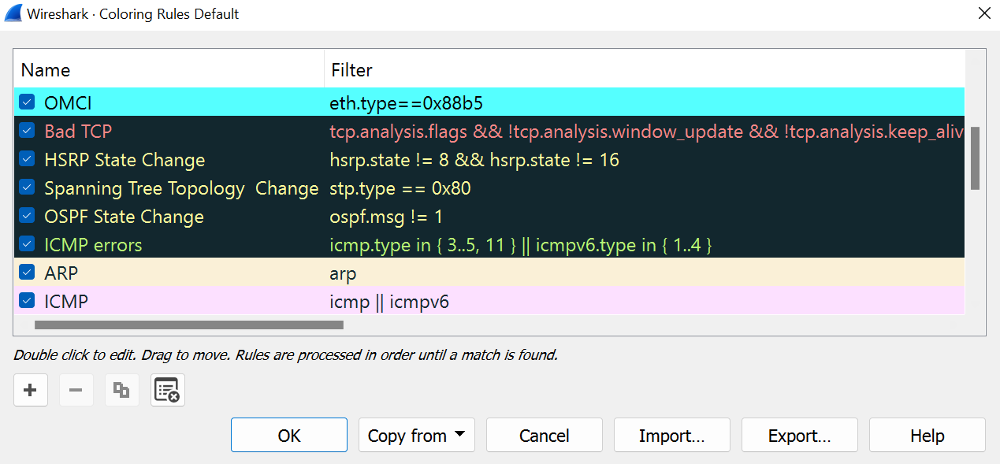
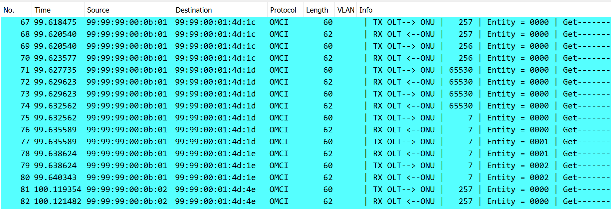

## Wireless Capture Files 

#### In This section, you will find captures files for OMIC (Optical Modem Inband Control) Standard.

Prerequisites for the capture filters:

- [Wireshark](https://www.wireshark.org/download.html) installed on your machine.

- [OMIC Wireshark Package](https://github.com/0liv1er/omci-wireshark-dissector) installed on your machine and configured for wireshark interpretation. 

The following filters strings was tested in Version 4.0.6 (v4.0.6-0-gac2f5a01286a) of Wireshark.

---
### Wireshark configuration To Coloring-Rules:

To use the coloring rules, you can use the filters described below to create a new rule in Wireshark. 

```
View -> Coloring Rules -> New Coloring Rule
```



--- 
### Capture Wireshark Example: 

Once the OMIC Wireshark Package is installed, you can open the capture file and see the OMIC frames in the Wireshark, like the example below:



--- 


