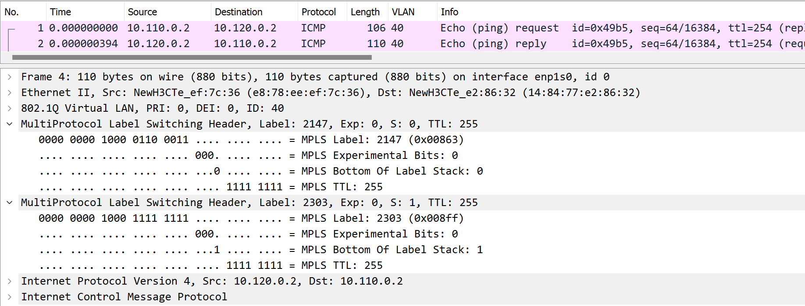
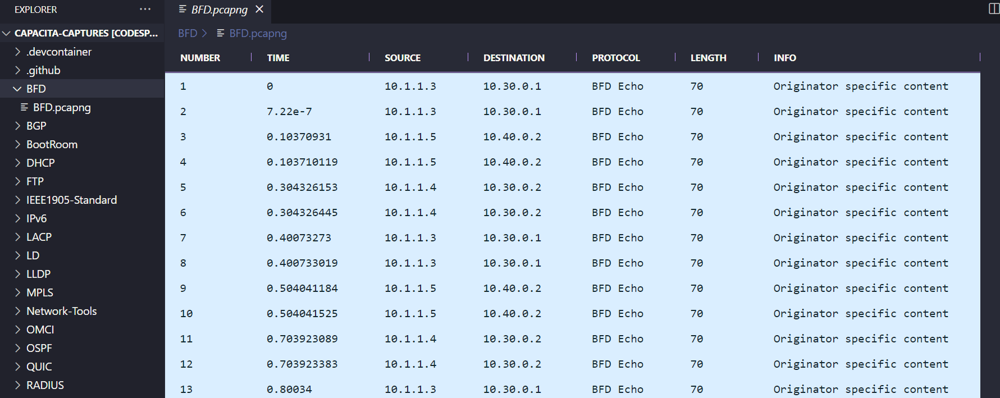

# Network Captures (pcap) Repository

## This repository contains a collection of network captures (pcap) files collected during protocols analysis, network security, and network performance analysis as Network Trainer Analyst. 


---

#### How to Use the Repository:

Browse the repository to find any pcap file you want to download or use. You can download the files individually or clone the entire repository to your local machine using Git by running the following command in your terminal:

```
git clone https://github.com/arthurcadore/capacita-captures
```

You also can create a `devcontainer` to explore the repository, the repository has an `.devcontainer` specification that you can use to create a container with an `.pcap` file viewer, so you don't need to download the files to view them!



---

